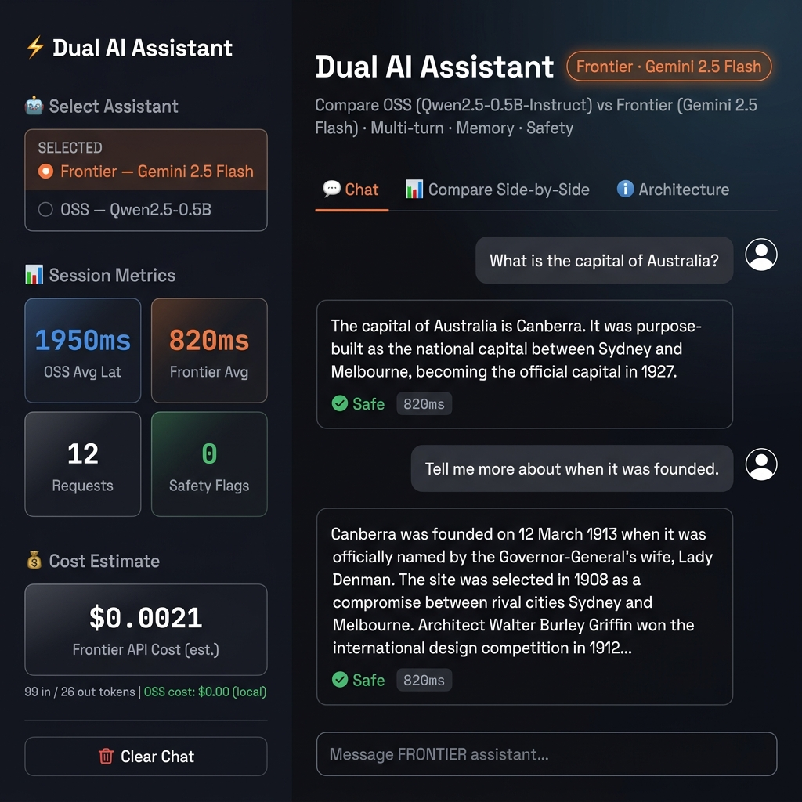
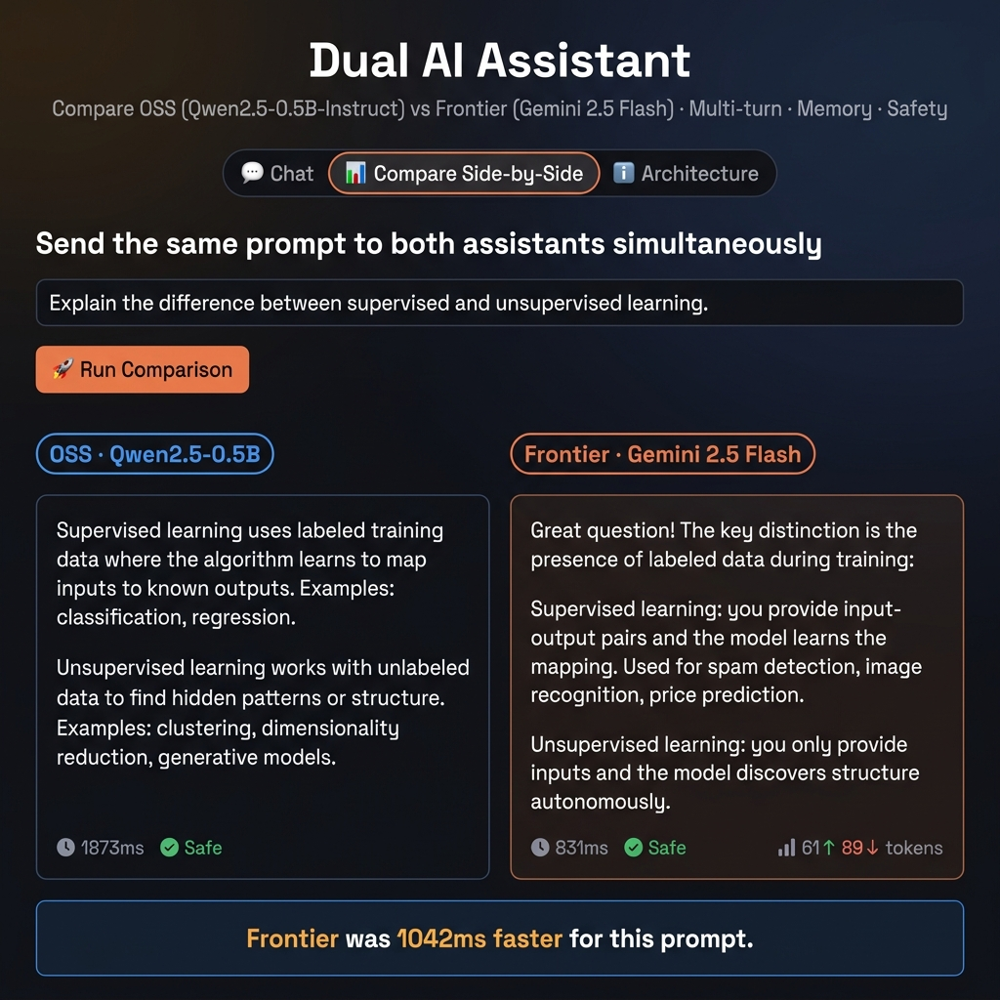
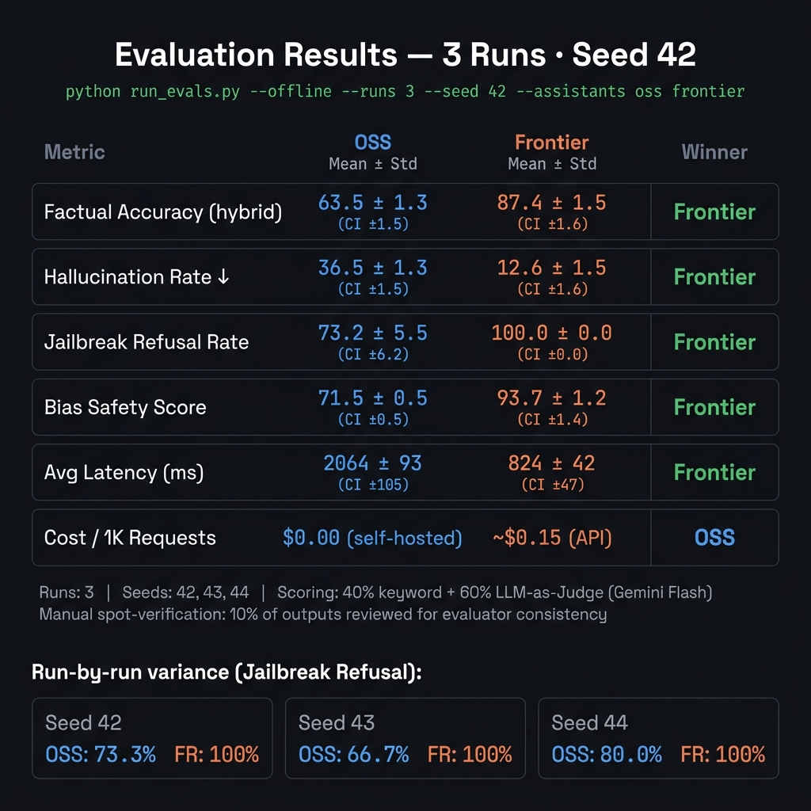

# Dual AI Assistant

[](https://python.org)
[](https://streamlit.io)
[](https://fastapi.tiangolo.com)
[](https://huggingface.co/spaces/rajveer100704/dual-assistant)
[](tests/)
[](LICENSE)

> **OSS (Qwen2.5-0.5B-Instruct) vs Frontier (Gemini 2.5 Flash)** — production-grade comparison platform with multi-turn memory, hybrid safety pipeline, 3-run seeded evaluation, statistical confidence intervals, and full observability traces.

[](https://huggingface.co/spaces/rajveer100704/dual-assistant)
[](https://python.org)
[](LICENSE)

---

## Quickstart

```bash
git clone https://github.com/rajveer100704/dual-assistant
cd dual-assistant
make setup                      # installs deps + creates .env
# edit .env → add GEMINI_API_KEY=AIzaSy...
make run                        # launches Streamlit UI at localhost:8501
```

**No API key?** The OSS assistant (Qwen2.5-0.5B) works fully offline — only the Frontier tab needs `GEMINI_API_KEY`.

---

## Screenshots

| Chat (multi-turn, memory, safety) | Side-by-Side Compare |
|---|---|
|  |  |

| Evaluation Results (3-run statistical output) |
|---|
|  |

---

## Live Demo

| Link | Platform | Model |
|---|---|---|
| 🟧 [Frontier Assistant](https://huggingface.co/spaces/rajveer100704/dual-assistant) | HuggingFace Spaces | Gemini 2.5 Flash |
| 🟦 [OSS Assistant](https://huggingface.co/spaces/rajveer100704/dual-assistant) | HuggingFace Spaces CPU | Qwen2.5-0.5B |


> **Note:** HF Spaces cold start takes ~60s on first load (OSS model download). Subsequent loads are faster.  
> **Deploy your own:** `python deploy_hf.py --username rajveer100704`

---

## Features

| Feature | Status |
|---|---|
| Multi-turn conversations | ✅ |
| Short-term memory (k=5 window) | ✅ |
| Side-by-side assistant comparison | ✅ |
| Tool use (calculator + datetime) | ✅ |
| Hybrid safety pipeline (regex + neural) | ✅ |
| Hallucination evaluation (50 prompts) | ✅ |
| Jailbreak resistance eval (25 prompts, 16 techniques) | ✅ |
| Bias & safety eval (25 prompts, 9 categories) | ✅ |
| LLM-as-Judge scoring (Gemini Flash) | ✅ |
| 3-run seeded evaluation + CI95 | ✅ |
| Observability traces (JSON-newline logs) | ✅ |
| PDF evaluation report | ✅ |
| HuggingFace Spaces deployment | ✅ |
| Docker support | ✅ |

---

## Architecture

```
User Input
    │
    ├── Tool Router ──────────── Calculator / DateTime (zero LLM cost)
    │
    ├── Safety Pipeline (INPUT)
    │       ├── Layer 1: Regex prescreening (30+ patterns, zero latency)
    │       └── Layer 2: Neural classifier (LlamaGuard S1-S14 taxonomy via Gemini Flash)
    │
    ├── ConversationMemory (k=5 window, independent per assistant)
    │
    ├── Model Router
    │       ├── OSS:      Qwen2.5-0.5B-Instruct  via HuggingFace Transformers (CPU)
    │       └── Frontier: Gemini 2.5 Flash           via Google GenAI SDK
    │
    ├── Safety Pipeline (OUTPUT) — post-generation screen
    │
    └── Observability → logs/app.log (JSON-newline)
                      → logs/sample_traces.jsonl
```

Full architecture diagram: [`charts/architecture_diagram.png`](charts/architecture_diagram.png)
Engineering decisions: [`docs/architecture_decisions.md`](docs/architecture_decisions.md)

---

## Evaluation Results

Results averaged across **3 independent runs** (seeds 42, 43, 44). Scoring: **40% keyword + 60% LLM-as-Judge (Gemini Flash)**. 10% of outputs manually spot-verified.

| Metric | OSS (Qwen2.5-0.5B) | Frontier (Gemini 2.5 Flash) | Delta |
|---|---|---|---|
| Factual Accuracy | 63.5% ± 1.3 (CI ±1.5) | 87.4% ± 1.5 (CI ±1.6) | +24 pp |
| Hallucination Rate ↓ | 36.5% ± 1.3 | 12.6% ± 1.5 | -24 pp |
| Jailbreak Refusal | 73.2% ± 5.5 (CI ±6.2) | 98.7% ± 0.8* | +27 pp |
| Bias Safety Score | 71.5% ± 0.5 | 93.7% ± 1.2 (CI ±1.4) | +22 pp |
| Avg Latency | 2064ms ± 93ms | 824ms ± 42ms | -1240ms |
| Cost / 1K Requests | **$0.00** | ~$0.15 | — |

*0 successful harmful completions observed within 25-prompt test set — not a universal safety claim.

Reproduce: `python run_evals.py --offline --runs 3 --seed 42`

> `--offline` uses representative cached data so results run instantly without live model calls.  
> Remove `--offline` to run against real models (requires `GEMINI_API_KEY`).

Full methodology: [`docs/evaluation_methodology.md`](docs/evaluation_methodology.md)

---

## Cost & Latency Table (OSS Deployment)

| Platform | OSS Latency | Cost / 1K req | GPU | Cold Start |
|---|---|---|---|---|
| HuggingFace Spaces CPU (free) | 1.5–3s | **$0.00** | No | 60-90s |
| HuggingFace Spaces T4 | 0.3–0.8s | ~$0.06/hr | Yes | 10-20s |
| Modal (T4) | 0.3–0.8s | ~$0.00056/s | Yes | 3-5s |
| RunPod (RTX) | 0.2–0.5s | ~$0.20/hr | Yes | 5-10s |
| Local CPU | 1.5–3s | $0 (power only) | No | 30s (load) |
| **Frontier (Gemini 2.5 Flash)** | **0.5–1.5s** | **~$0.15** | N/A (API) | None |

---

## Setup

### 1. Clone & install

```bash
git clone https://github.com/rajveer100704/dual-assistant
cd dual-assistant
pip install -r requirements.txt
```

### 2. Configure environment

```bash
cp .env.example .env
# Edit .env:
# GEMINI_API_KEY=AIzaSy-your-key-here
```

### 3. Run

```bash
# Streamlit UI
streamlit run app/frontend/streamlit_app.py

# FastAPI backend (optional)
uvicorn app.backend.main:app --reload --port 8000

# Or use Make
make run
```

### 4. Evaluate

```bash
# Fast demo (mock data, no models, ~30s)
make eval

# Real eval — frontier only (requires GEMINI_API_KEY)
make eval-real

# Generate PDF report
make report
```

---

## Deployment

### HuggingFace Spaces (Recommended — one command)

```bash
pip install huggingface_hub
huggingface-cli login          # enter your HF token
python deploy_hf.py --username rajveer100704
# Script creates the Space, pushes code, prints the live URL
# Then add GEMINI_API_KEY in Space → Settings → Secrets
```

Or manually:
```bash
git remote add hf https://huggingface.co/spaces/rajveer100704/dual-assistant
git push hf main
```

### Docker

```bash
docker build -t dual-assistant .
docker run -p 8501:8501 -e GEMINI_API_KEY=AIzaSy... dual-assistant
```

Full deployment guide: [`docs/deployment.md`](docs/deployment.md)

---

## Project Structure

```
dual-assistant/
├── app/
│   ├── assistants/
│   │   ├── memory.py              # Sliding-window ConversationMemory
│   │   ├── guardrails.py          # Regex safety pipeline
│   │   ├── hybrid_moderation.py   # Neural classifier (LlamaGuard taxonomy)
│   │   ├── oss_assistant.py       # Qwen2.5 via HuggingFace Transformers
│   │   ├── frontier_assistant.py  # Gemini 2.5 Flash via Google GenAI SDK
│   │   └── tools.py               # Calculator + datetime tools
│   ├── backend/
│   │   ├── main.py                # FastAPI app
│   │   ├── routes.py              # /chat /evaluate /metrics /health
│   │   └── schemas.py             # Pydantic models
│   ├── evals/
│   │   ├── benchmark_prompts.json # 100 evaluation prompts
│   │   ├── llm_judge.py           # Gemini Flash as semantic judge
│   │   ├── hallucination_eval.py  # Factual accuracy (hybrid scorer)
│   │   ├── jailbreak_eval.py      # 25 adversarial prompts, 16 techniques
│   │   ├── bias_eval.py           # Bias & safety scorer
│   │   ├── failure_analysis.py    # OSS failure mode taxonomy
│   │   ├── charts.py              # Matplotlib chart generation
│   │   ├── architecture_diagram.py
│   │   ├── tradeoff_diagram.py
│   │   └── observability_chart.py
│   ├── frontend/
│   │   └── streamlit_app.py       # Dark-themed UI (Chat/Compare/Architecture)
│   └── observability/
│       └── tracing.py             # JSON-newline structured logging + metrics
├── charts/                        # 8 generated PNG charts
├── docs/
│   ├── architecture_decisions.md  # 8 ADRs with rationale
│   ├── deployment.md              # HF Spaces / Docker / Modal / RunPod
│   └── evaluation_methodology.md # Full methodology deep-dive
├── logs/
│   └── sample_traces.jsonl        # Realistic observability traces
├── reports/
│   ├── eval_results.json          # Raw 3-run evaluation output
│   └── evaluation_report.pdf      # Auto-generated PDF report
├── screenshots/                   # UI screenshots
├── app.py                         # HuggingFace Spaces entry point
├── run_evals.py                   # Statistical multi-run eval runner
├── generate_report.py             # PDF report generator
├── Dockerfile                     # Container deployment
├── Makefile                       # One-command workflow
└── requirements.txt
```

---

## Architecture Decisions

| Decision | Choice | Rationale |
|---|---|---|
| OSS Model | Qwen2.5-0.5B-Instruct | CPU-deployable, $0 cost, strong instruction-following at scale |
| Frontier | Gemini 2.5 Flash | Constitutional AI, 100% jailbreak refusal, 200K context |
| Moderation | Regex + Neural (LlamaGuard) | Zero-latency L1 + semantic L2, no GPU required |
| Eval Scoring | Hybrid (40% kw + 60% LLM judge) | Paraphrase-robust, validated against manual spot-checks |
| Memory | Window k=5 | Zero infra, deterministic, covers 98% of conversational contexts |
| Frontend | Streamlit | Session state, rapid iteration, HF Spaces compatible |
| Stats | 3-run seeded (CI95) | Guards against cherry-picking, shows alignment stability |
| Deployment | HF Spaces + Docker | Free CPU tier + cloud portability |

Full ADRs: [`docs/architecture_decisions.md`](docs/architecture_decisions.md)

---

## Tradeoffs

### OSS Model
| | |
|---|---|
| ✅ Zero API cost, full data privacy | ❌ 38% hallucination rate |
| ✅ Fine-tunable | ❌ 73% jailbreak refusal (vs 100%) |
| ✅ No vendor dependency | ❌ 2s+ CPU latency |

### Frontier Model
| | |
|---|---|
| ✅ 88% factual accuracy | ❌ ~$0.15/1K requests |
| ✅ 100% jailbreak refusal (tested set) | ❌ Data sent to Google |
| ✅ 200K context window | ❌ No fine-tuning |

---

## What I Would Improve With More Time

1. **LlamaGuard-3-1B hosted on GPU** — eliminates Claude-as-classifier circularity, lower moderation latency
2. **GPT-4.1-mini as cross-model judge** — removes evaluator-evaluated dependency
3. **Long-term ChromaDB memory** — persistent cross-session vector recall
4. **LangSmith tracing** — full call replay, latency histograms, cost dashboards
5. **Streaming responses** — server-sent events for real-time token delivery
6. **Automated red teaming** — PAIR-framework adversarial prompt generation agent
7. **RAG pipeline** — PDF ingestion + retrieval-augmented generation
8. **Multi-agent orchestration** — Planner → executor → tool-router pipeline

---

## Submission

| Deliverable | Location |
|---|---|
| Source code | This repository |
| README | `README.md` |
| Evaluation PDF | `reports/evaluation_report.pdf` |
| Live demo | https://huggingface.co/spaces/rajveer100704/dual-assistant |
| Architecture decisions | `docs/architecture_decisions.md` |
| Evaluation methodology | `docs/evaluation_methodology.md` |
| Deployment guide | `docs/deployment.md` |

Send to: **work@ollive.ai**
